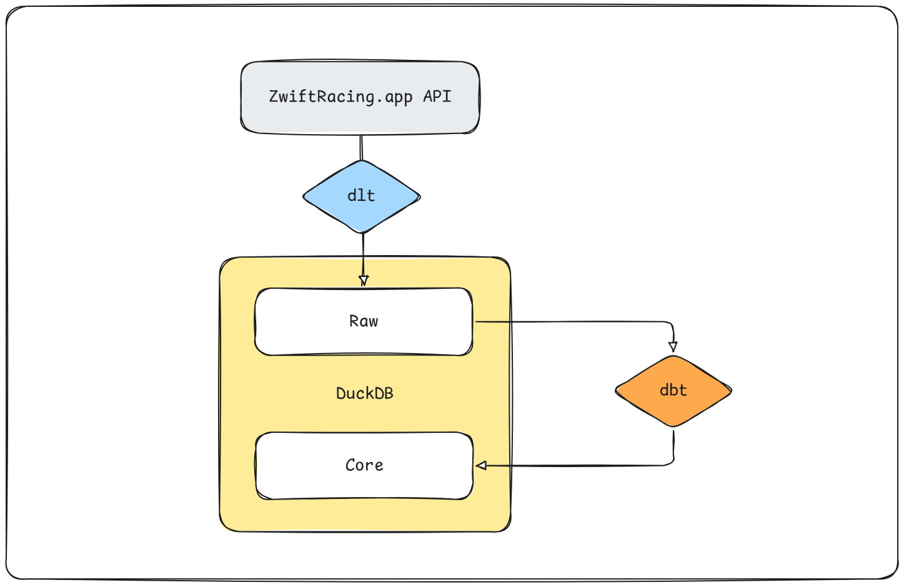

# Zwift DS

This platform collects data from the Zwift e-cycling training & racing platform. Data is prepared for use in analytics to help scout riders and prepare race strategy.

## DataStack

- ``git`` and GitHub for version control
- [GitHub](https://github.com/users/robgriffin247/projects/9) for project management
- ``uv`` for dependency management
- ``direnv`` for environment management
- DuckDB for data storage/warehousing
- ``dlt`` for ingestion (EL of ELT)
- ``dbt`` for transformation (T of ELT)
<!--
- Modal for scheduling in production
- Dagster for orchestration in development
-->

## Dev Workflow

The project is planned and tracked using [GitHub Projects](https://github.com/users/robgriffin247/projects/9). 

1. Issues are raised for features and fixes, and these automatically add tickets to the project
1. Once the ticket is created, head to the project and:
    - add any further details about the goal
    - assign developer
    - assign ticket type (feature/bug)
    - add a development branch naming with ``<feat/fix>-<ticket-number>/<ticket-title>``
    - ``git fetch origin`` to bring the branch to local
    - move the ticket to planned
1. Checkout to the dev branch and develop
1. Push to GitHub and create a pull request when dev is complete
1. Review the code
1. Request changes or merge the code to main
